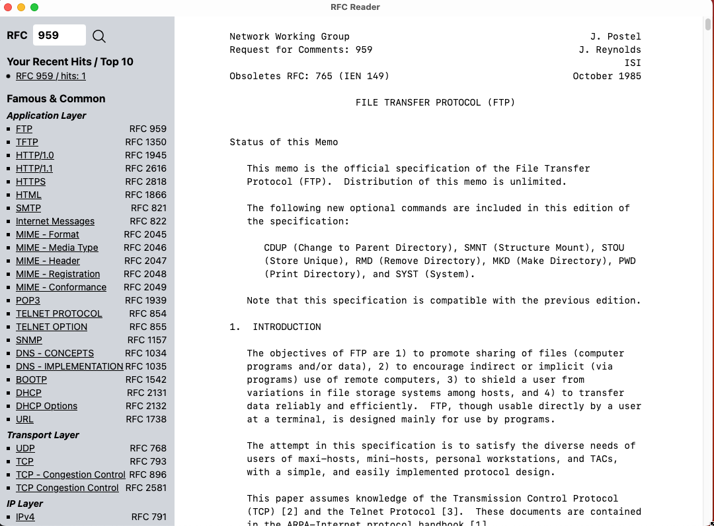

## RFC Reader

### Introduction
This is a tool for reading RFC docs. It will download RFC text file from [RFC Editor](https://www.rfc-editor.org/). So, you don't have to download it again next time.

The working app looks like this:

This app is based on:
* [Tauri](https://tauri.app/)
* [ReactJS](https://reactjs.org/)
* [TailwindCSS](https://tailwindcss.com/)
* [https://vitejs.dev/](https://vitejs.dev/)

**Thanks for those awesome projects.**

